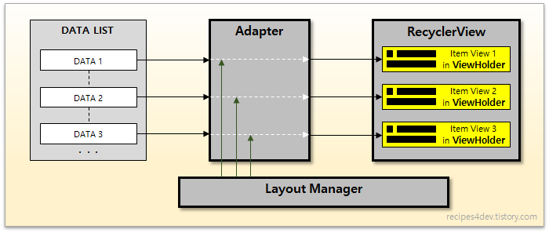

# RecyclerView 사용

### RecyclerView
+ 사용자가 관리하는 많은 수의 데이터 집합(Data Set)을 개별 아이템 단위로 구성하여 화면에 출력하는 뷰그룹(ViewGroup)이며, 한 화면에 표시되기 힘든 많은 수의 데이터를 스크롤 가능한 리스트로 표시해주는 위젯
+ ListView와 작동 방식이 비슷하다.
    + ListView에 유연함 ( Flexibility ), 성능 ( Performance )을 더하였다. -> ListView보다 RecyclerView를 사용하길 권장한다.
    + ListView와 차이점 : 재활용 ( Recycle ) - list 항목이 갱신될 때 새로운 view를 구성하기보다 있던 Viewholder를 재활용하여 단순히 데이터를 Viewholder의 itemView에 binding함으로써 성능저하문제를 해결한다.
+ 구성요소 : RecyclerView, Adapter, LayoutManager, ViewHolder
    
    + RecyclerView : data를 list형태로 화면에 표시하는 container 역할
    + Adapter : data list로부터 itemview 생성
        + onCreateViewHolder : viewholder 객체 생성
        + onBindViewHolder : position에 해당하는 데이터를 뷰홀더의 아이템뷰에 표시
        + getItemCount : 전체 item 개수 리턴
    + LayoutManager : adapter에서 itemview를 생성하기 이전에 배치 형태와 더 이상 화면에 표시되지 안쓰는 itemView를 언제 재활용 할 지 결정
        + 배치형태
            + LinearLayoutManager : 수평 ( Horizontal ) or 수직 ( Vertical ), 일렬 ( Linear ) 배치
            + GridLayoutManager : 바둑판 격자 ( Grid ) 모양
            + StaggeredGridLayoutManager : 엇갈림 격자
    + ViewHolder : 보통 adapter에 의해 관리되며, 미리 생성된 viewholder가 있을 때는 데이터를 viewholder의 itemview에 바인딩하여 재활용한다.

### RecyclerView 사용 순서

1. activity layout에 RecyclerView 추가 ( list_shop.xml , ItemListActivity.java )
2. item view layout 추가 (/res/layout/destination_list_item.xml )
3. adapter 구현 ( RecyclerAdapter.java )
4. adapter와 layoutManager 지정 ( ItemListActivity.java )

### RecyclerView는 아래의 파일과 관련되어있다.

ItemListActivity.java : recyclerView 포함한 activity, layoutManager도 포함
RecyclerAdapter.java : MyViewHolder를 내부 클래스로 가지고 있으며 binding, viewholder 생성
RecyclerItem.java
/res/layout/destination_list_item.xml
list_shop.xml

--------------
### 참조

+ RecyclerView 설명 : https://recipes4dev.tistory.com/154?category=790402
+ header, footer 구현 방법 참조 : https://dev-imaec.tistory.com/31 , https://sjh1253.tistory.com/entry/Android-RecyclerView-3-Header-Footer-Item-%EA%B5%AC%ED%98%84
+ item 이동, 변경, 삭제 구현 방법 참조 : https://everyshare.tistory.com/27 , https://m.blog.naver.com/PostView.nhn?blogId=mapl003&logNo=221500557973&proxyReferer=https:%2F%2Fwww.google.com%2F
+ recyclerview의 아이템 클릭을 activity까지 가져오기 ( callbackListener 이용, 실제 활용은 안함 ) : https://ppizil.tistory.com/entry/Recyclerview%EC%9D%98-%EC%95%84%EC%9D%B4%ED%85%9C-%ED%81%B4%EB%A6%AD%EC%9D%84-CallbackListener%EB%A5%BC-%ED%86%B5%ED%95%B4-Activity%EA%B9%8C%EC%A7%80-%EA%B0%80%EC%A0%B8%EC%98%A4%EA%B8%B0
